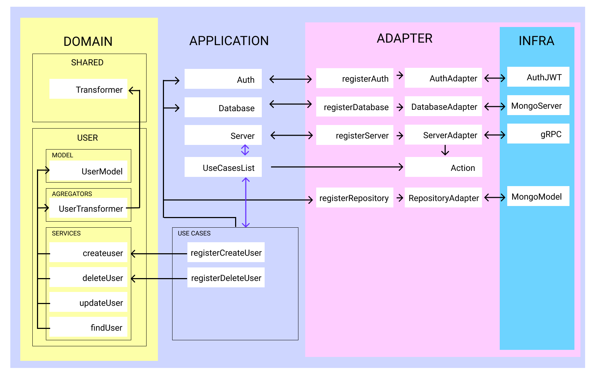
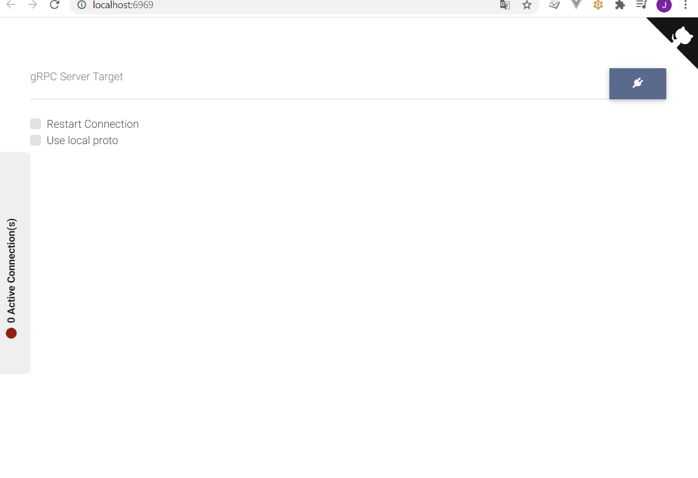

# Auth Microservice using DDD

This is a example microservice using DDD architecture.

### Depedencies

* Nodejs
* Docker

### Features

* Typescript
* Protocol GRPC
* MongoDB

### Architecture



### Getting started

```bash
# Run Microservice in shared mode to program in hot
# Run MongoDB Server
# Run GRPC Server
npm run docker

# Enter in this link
# Set file proto in path `./grpc/proto/data.proto`
http://localhost:6969/


"gRPC Server Target" = auth-service:5000

"Use local proto" = true

# Can test using this action
{
  "action": "createUser",
  "data": "{\"username\": \"johnconnor\", \"password\": \"1234\"}"
}
 
```


